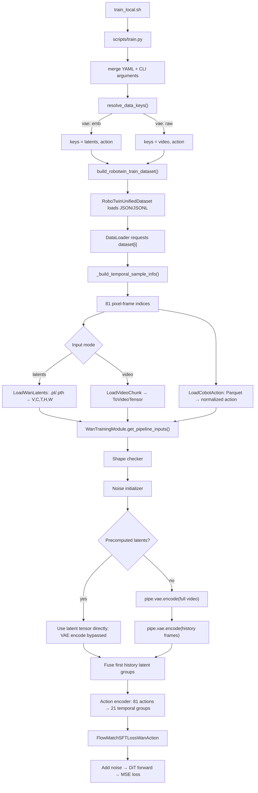

# BWM Training Data Format and Data Flow

This trainer does not consume LeRobot metadata directly. It expects a custom flat sample manifest. Pointing `DATASET_METADATA_PATH` at `episodes_stats.jsonl` causes that statistics file to be interpreted as the sample manifest, leading to the reported missing-Parquet-path error.

## End-to-end call graph



Relevant entry points:

- Input-key selection: [`wan_video_action/parsers.py`](../wan_video_action/parsers.py), `resolve_data_keys()`.
- Dataset construction: [`wan_video_action/data/wan_dataset.py`](../wan_video_action/data/wan_dataset.py), `build_robotwin_train_dataset()`.
- Per-sample parsing: [`wan_video_action/data/wan_dataset.py`](../wan_video_action/data/wan_dataset.py), `RoboTwinUnifiedDataset.__getitem__()`.
- Training-module forwarding: [`scripts/train.py`](../scripts/train.py), `WanTrainingModule.get_pipeline_inputs()`.
- Pipeline units: [`wan_video_action/pipelines/wan_video_action.py`](../wan_video_action/pipelines/wan_video_action.py), `WanVideoActionPipeline.from_pretrained()`.
- VAE/raw-latent branch: [`wan_video_action/pipelines/wan_video_action.py`](../wan_video_action/pipelines/wan_video_action.py), `WanVideoUnit_InputVideoEmbedder`.
- Loss: [`wan_video_action/loss.py`](../wan_video_action/loss.py), `FlowMatchSFTLossWanAction()`.

## Why `episodes_stats.jsonl` fails

`train_local.sh` points to:

```bash
${DATASET_DIR}/meta/episodes_stats.jsonl
```

A row in that file is shaped like:

```json
{
  "episode_index": 0,
  "stats": {
    "joint_abs": {},
    "eef_abs": {}
  }
}
```

During `dataset[0]`, the resolved keys are currently:

```python
["latents", "action"]
```

Because the row has no top-level `action`, the dataset passes the entire metadata row to `LoadCobotAction`:

```python
source = data[key] if key in data else data
```

`LoadCobotAction` then searches that object for:

```python
parquet_rel = data.get("data")
```

There is no `data`, so it raises:

```text
KeyError: "Missing parquet path in metadata 'data' field."
```

Changing to `meta/episodes.jsonl` does not solve the problem. Those rows contain `episode_index`, `tasks`, `instruction`, and `length`, but still contain no `video` or `latents` path and no `action` path.

The loader does not interpret:

- `meta/info.json`;
- the `data_path` template in `info.json`;
- the `video_path` template in `info.json`; or
- standard LeRobot episode metadata.

All paths must already be expanded into the flat training manifest.

## Required custom manifest

There are two supported input modes.

### Mode 1: raw videos with VAE encoding during training

Set:

```yaml
model:
  modes:
    vae: "raw"
```

The manifest must contain rows like:

```json
{
  "episode_index": 0,
  "video": "videos/chunk-000/observation.images.front/episode_000000.mp4",
  "action": "data/chunk-000/episode_000000.parquet",
  "start_frame": 0,
  "end_frame": 139,
  "length": 140,
  "raw_length": 140
}
```

For multiple synchronized views:

```json
{
  "video": [
    "videos/chunk-000/observation.images.front/episode_000000.mp4",
    "videos/chunk-000/observation.images.left/episode_000000.mp4"
  ],
  "action": "data/chunk-000/episode_000000.parquet",
  "start_frame": 0,
  "end_frame": 139,
  "raw_length": 140
}
```

The video loader produces:

```text
(V, 3, 81, 480, 640), float32, range [-1, 1]
```

This is sent to `pipe.vae.encode()` by `WanVideoUnit_InputVideoEmbedder`.

### Mode 2: precomputed latents

The current config uses:

```yaml
vae: "emb"
```

The manifest must therefore contain:

```json
{
  "episode_index": 0,
  "latents": "latents/chunk-000/episode_000000.pt",
  "action": "data/chunk-000/episode_000000.parquet",
  "start_frame": 0,
  "end_frame": 139,
  "length": 140,
  "raw_length": 140
}
```

Each `.pt` or `.pth` file must load as a tensor:

```text
(V, C_latent, T_latent, H_latent, W_latent)
```

For an 81-pixel-frame sample, the model expects 21 temporal latent groups:

```text
T_latent = 1 + (81 - 1) // 4 = 21
```

In this mode, `pipe.vae.encode()` is not called. The precomputed tensor is passed directly into the diffusion pipeline.

The current converted dataset has no latent files, so `vae: emb` cannot consume it.

## Temporal sampling

The selected config specifies:

```text
num_frames = 81
num_history_frames = 9
```

The dataset produces:

- 9 history pixel frames;
- 72 future pixel frames;
- 81 action rows; and
- 21 latent temporal groups.

For an episode starting at frame zero, the current sampler generates:

```text
[0, 0, 0, 0, 0, 0, 0, 0, 0, 1, 2, ..., 72]
```

The initial frame is repeated to fill the unavailable history.

`robotwin2BWM.py` expands each episode into deterministic temporal windows. With
the default 81 total frames and 9 history frames, window starts advance by 72
future frames. If the final stride would leave an uncovered tail, one additional
full window is aligned to the end of the episode. The MP4 and Parquet files are
shared by all windows; only manifest rows are duplicated.

For example, a 150-frame episode produces future starts `1`, `73`, and `78`.
The last window overlaps the previous one but covers frames through `149`
without padding or repeating the final frame. Use `--window-stride` to select a
different overlap.

The converter also splits every task by its sorted episode order:

- the first 40 episodes are written to `metadata_train.jsonl`;
- the last 10 episodes are written to `metadata_test.jsonl`; and
- `metadata.jsonl` contains the same rows as `metadata_train.jsonl` for
  compatibility with existing training launch scripts.

Each manifest row includes `split: "train"` or `split: "test"`. `stat.json` is
computed from training episodes only, so test actions do not leak into the
normalization bounds. The split sizes can be changed with
`--train-episodes-per-task` and `--test-episodes-per-task`; a task with too few
episodes is rejected instead of creating overlapping splits.

`length` or `end_frame` is important. Without either one, the dataset silently treats the sample as a one-frame range. `raw_length` is recommended so future indices can be bounded by the complete underlying episode.

## Action data

The action manifest value must be a Parquet path:

```json
"action": "data/chunk-000/episode_000000.parquet"
```

For `action_type: eef_abs`, the code translates the type to internal name `state_pose`, then reads the Parquet column:

```text
observation.state
```

It accepts:

- 26 values per row: a combined joint/EEF representation, from which it extracts 14 EEF values; or
- 14 values per row: an already-selected Euler EEF representation.

The expected 14-dimensional order is:

```text
left position x
left position y
left position z
left Euler rotation x
left Euler rotation y
left Euler rotation z
left gripper
right position x
right position y
right position z
right Euler rotation x
right Euler rotation y
right Euler rotation z
right gripper
```

The loader returns:

```text
action shape = (1, 81, 14)
```

The action encoder groups the 81 pixel-frame actions into 21 temporal groups.

## Action statistics

`action_stat_path` is required whenever action conditioning is enabled.

For `action_type: eef_abs`, accepted structures include:

```json
{
  "state_pose": {
    "p01": [0, 0, 0, 0, 0, 0, 0, 0, 0, 0, 0, 0, 0, 0],
    "p99": [1, 1, 1, 1, 1, 1, 1, 1, 1, 1, 1, 1, 1, 1]
  }
}
```

or:

```json
{
  "eef_abs": {
    "min": [0, 0, 0, 0, 0, 0, 0, 0, 0, 0, 0, 0, 0, 0],
    "max": [1, 1, 1, 1, 1, 1, 1, 1, 1, 1, 1, 1, 1, 1]
  }
}
```

The loader:

- first searches for `state_pose`, then `eef_abs`;
- prefers `p01` and `p99` when both exist;
- otherwise falls back to `min` and `max`;
- ignores `mean`, `std`, and `shape`; and
- normalizes and clips every value to `[-1, 1]`.

The normalization is:

```text
normalized = 2 * (value - lower) / (upper - lower + 1e-8) - 1
```

Every selected bound array must have the same dimensionality, ordering, units, Euler convention, and gripper convention as the selected Parquet action representation.

## Incompatibilities in the current converted dataset

The current `converted_dataset/adjust_bottle/...` Parquet files contain:

```text
joint_abs: 14-D
eef_abs:   16-D
```

They do not contain:

```text
observation.state
action
```

A flat candidate manifest therefore reaches the next failure:

```text
ArrowInvalid: No match for FieldRef ... observation.state
```

The converted `eef_abs` is 16-dimensional:

```text
left:  position(3) + quaternion(4) + gripper(1)
right: position(3) + quaternion(4) + gripper(1)
```

The current training loader expects a 14-dimensional Euler representation. The converted `meta/stats.json` consequently also contains 16-element `eef_abs` bounds, which are incompatible with `action_dim: 14`.

## Required changes for the existing converted data

The shortest route using the existing MP4 files is:

1. Set `vae: raw`.
2. Generate a custom JSONL manifest containing expanded `video` and `action` paths.
3. Choose an action representation:
   - convert the 16-D quaternion `eef_abs` into the expected 14-D Euler representation and expose it through `observation.state`; or
   - extend `LoadCobotAction` and set `action_dim: 16` to train directly on quaternion EEF data.
4. Generate normalization statistics matching the selected 14-D or 16-D representation.
5. Point `DATASET_METADATA_PATH` to the new flat manifest rather than an existing LeRobot `meta/*.jsonl` file.

## Validation performed

The diagnosis was validated by:

- reproducing the exact `episodes_stats.jsonl` error;
- inspecting the converted dataset's metadata, Parquet, video, and statistics schemas;
- loading the repository demo successfully in raw-video mode; and
- confirming that the resulting demo sample has video shape `(1, 3, 81, 480, 640)` and action shape `(1, 81, 14)`.
